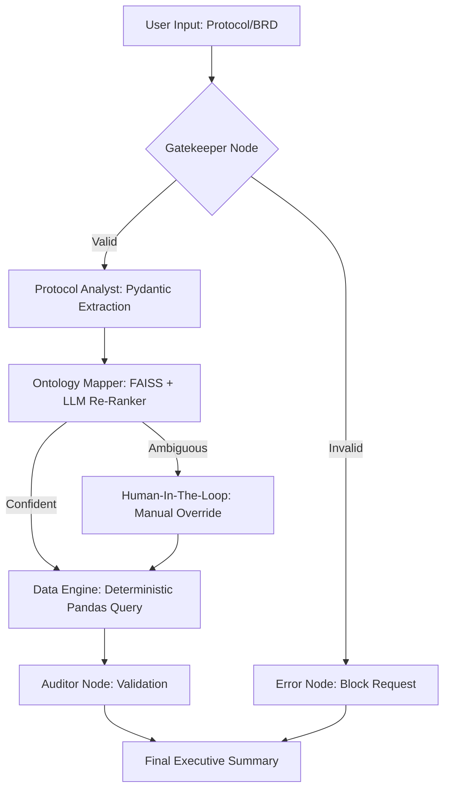

# PRD Prompt — AI Clinical Trial Patient Matcher

> **Upload this entire file to Google AI Studio as context.**

---

You are an expert software architect and product manager. Below is a complete Product Requirements Document (PRD) for an enterprise AI project called **"AI Clinical Trial Patient Matcher"**. Use this as full context to understand the system, answer questions about it, extend it, or build upon it.

---

## 1. PROJECT OVERVIEW

**Project Name:** AI Clinical Trial Patient Matcher  
**Client / Sponsor:** Agilisium (Proof-of-Concept / Demo)  
**Type:** Enterprise AI Agent System — Life Sciences & Pharma  
**Status:** Working Proof-of-Concept (fully functional)

### 1.1 Problem Statement

Pharmaceutical companies and CROs (Contract Research Organizations) spend significant time and resources manually screening patient databases against clinical trial protocols (BRDs — Business Requirement Documents). These protocols are verbose, unstructured medical documents with embedded inclusion/exclusion criteria buried inside regulatory boilerplate. Traditional approaches using naive RAG (Retrieval-Augmented Generation) over patient records are prone to:

- **LLM Hallucinations** — The model invents patient matches that don't exist.
- **Semantic Mismatch** — Protocol language like "chronically elevated systemic arterial pressure" doesn't exactly match database column value "Hypertension".
- **Non-Deterministic Outputs** — Running the same query twice yields different patient lists.

### 1.2 Solution

A **Stateful Multi-Agent Architecture** built on LangGraph that separates concerns into specialized "Agent Nodes", each responsible for a distinct phase of the matching pipeline. The key innovation is a **Schema-Aware RAG Architecture** where:

1. The LLM extracts raw clinical criteria from unstructured BRDs.
2. A FAISS Vector Database resolves those raw terms to official database schema values (Ontology Mapping).
3. A deterministic Pandas engine performs exact-match filtering — zero hallucination in the data retrieval layer.

---

## 2. ARCHITECTURE & SYSTEM DESIGN

### 2.1 Tech Stack

| Layer | Technology | Purpose |
|-------|-----------|---------|
| **Frontend** | Streamlit | Interactive step-by-step workflow UI |
| **Agent Orchestration** | LangGraph (StateGraph) | Graph-based stateful multi-agent choreography |
| **LLM Provider** | Groq (Cloud API) | High-speed inference for Llama-3 models |
| **Routing LLM** | `llama-3.1-8b-instant` | Fast, cheap gatekeeper/routing decisions |
| **Reasoning LLM** | `llama-3.1-70b-versatile` | Heavy extraction & re-ranking tasks |
| **Schema Enforcement** | Pydantic (via LangChain `with_structured_output`) | Forces LLM to return strict JSON schema |
| **Vector Database** | FAISS (faiss-cpu) | Ontology term similarity search |
| **Embedding Model** | `all-MiniLM-L6-v2` (SentenceTransformers) | Generates 384-dim embeddings for ontology terms |
| **Data Engine** | Pandas | Deterministic patient filtering (exact equality) |
| **Patient Database** | CSV hosted on AWS S3 (~55,000 records) | Synthetic healthcare dataset |
| **Containerization** | Docker | Production deployment |
| **Language** | Python 3.10 |  |

### 2.2 Dependencies (requirements.txt)

```
streamlit==1.32.0
langgraph>=0.2.0
langchain-core>=0.2.0
langchain-groq>=0.1.0
pandas==2.2.1
python-dotenv==1.0.1
pydantic==2.6.4
faiss-cpu
torch (CPU-only)
sentence-transformers
numpy
python-docx
openpyxl
requests
```

### 2.3 Environment Variables

```
GROQ_API_KEY=<groq_api_key>
```

---

## 3. MULTI-AGENT PIPELINE (LangGraph Workflow)

The system uses a **5-node LangGraph StateGraph** with conditional routing. Each node is a specialized "agent" with a single responsibility.

### 3.1 LangGraph State Schema

```python
class AgentState(TypedDict):
    user_input: str            # Raw BRD/protocol text
    is_valid: str              # "VALID" or "INVALID" from Gatekeeper
    extracted_json: Dict       # Raw structured criteria from Protocol Analyst
    mapped_json: Dict          # Schema-resolved criteria from Ontology Mapper
    eligible_patients: str     # Final patient DataFrame (as string)
    final_output: str          # Executive summary text
```

### 3.2 Node Descriptions

#### Node 0 — The Gatekeeper (Semantic Router / Red-Team Defense)
- **LLM:** `llama-3.1-8b-instant` (fast, cheap)
- **Purpose:** Security guardrail. Inspects user input and classifies it as "VALID" (clinical protocol) or "INVALID" (general question, prompt injection, irrelevant query).
- **Behavior:** If INVALID → routes to Error Node which blocks the request. If VALID → routes to Extractor.
- **Input Truncation:** First 2,000 characters only (performance optimization).

#### Node 1 — The Protocol Analyst (Reasoning Engine)
- **LLM:** `llama-3.1-70b-versatile` with **Pydantic structured output**
- **Purpose:** Parses verbose clinical trial BRDs and extracts patient eligibility criteria into a strict JSON schema.
- **Key Innovation:** Uses LangChain's `with_structured_output(ClinicalCriteria)` to force the LLM to return data matching a Pydantic model — no manual JSON parsing.
- **Scope Restriction:** The prompt explicitly tells the LLM to ONLY extract patient-facing criteria (age, gender, conditions, medications) and IGNORE regulatory, operational, and methodological sections.

**Pydantic Schema (ClinicalCriteria):**

```python
class ClinicalCriteria(BaseModel):
    # Inclusion Criteria
    age_min: Optional[int]
    age_max: Optional[int]
    gender: Optional[str]
    medical_condition: Optional[str]
    admission_type: Optional[str]
    blood_type: Optional[str]
    medication: Optional[str]
    test_results: Optional[str]
    # Exclusion Criteria
    exclude_medication: Optional[str]
    exclude_test_results: Optional[str]
    exclude_admission_type: Optional[str]
```

#### Node 2 — The Ontology Mapper (Entity Resolver + Re-Ranker)
- **Technologies:** FAISS Vector DB + `all-MiniLM-L6-v2` embeddings + LLM Re-Ranking
- **Purpose:** Bridges the "semantic gap" between raw LLM-extracted terms and exact database column values.
- **Process:**
  1. Takes each extracted field value (e.g., `medical_condition = "chronically elevated systemic arterial pressure"`).
  2. Encodes it into a 384-dim vector using SentenceTransformers.
  3. Performs Top-K=5 similarity search against the FAISS Ontology Index.
  4. Sends the Top-5 candidates to the LLM Re-Ranker, which picks the best match or returns "AMBIGUOUS".
  5. If AMBIGUOUS → triggers **Human-In-The-Loop (HITL)** in the Streamlit UI for manual clinician override.
- **Fields Mapped:** `medical_condition`, `admission_type`, `blood_type`, `medication`, `test_results`

#### Node 3 — The Data Engine (Deterministic Pandas Query)
- **Technology:** Pure Pandas — no LLM involvement
- **Purpose:** 100% deterministic, zero-hallucination patient filtering using exact equality matches.
- **Process:**
  1. Starts with the full patient DataFrame (~55,000 records).
  2. Applies each inclusion filter as strict equality (e.g., `df['Medical Condition'] == 'Hypertension'`).
  3. Applies each exclusion filter as not-equal (e.g., `df['Medication'] != 'Lipitor'`).
  4. Produces a detailed **filter log** showing patient count reductions at each step.
- **Handles:** Age range filtering (min/max), gender, medical condition, admission type, blood type, medication, test results + all exclusion variants.

#### Node 4 — The Auditor (Validation & Summary)
- **Purpose:** Formats the final executive summary of matched patients.

### 3.3 Workflow Graph (Mermaid)



### 3.4 Multi-Model Strategy

The system uses **two different LLMs** for cost and latency optimization:

| Task | Model | Rationale |
|------|-------|-----------|
| Gatekeeper routing | `llama-3.1-8b-instant` | Blazing fast, cheap — simple binary classification |
| Protocol extraction | `llama-3.1-70b-versatile` | High accuracy needed for structured medical data extraction |
| Ontology re-ranking | `llama-3.1-70b-versatile` | Context-aware medical term resolution |

### 3.5 Rate Limiting Strategy

The system uses the **Groq Free Tier** which has strict TPM (Tokens Per Minute) limits. Mitigations:

- **`tenacity` retry decorator** with exponential backoff (multiplier=2, min=5s, max=30s, 5 attempts).
- **5-second sleep** before each LLM call to prevent burst limits.
- **Document truncation** safety net at 3,000 words for extremely large documents.

---

## 4. DATA PIPELINE (Phase 0)

### 4.1 Patient Database

- **Source:** Synthetic healthcare dataset hosted on AWS S3.
- **URL:** `https://clinicaldata-765366202501-ap-southeast-2-an.s3.ap-southeast-2.amazonaws.com/healthcare_dataset.csv`
- **Size:** ~55,000 patient records, ~8.4MB

**Database Columns:**
- `Name`, `Age`, `Gender`, `Blood Type`, `Medical Condition`, `Date of Admission`, `Doctor`, `Hospital`, `Insurance Provider`, `Billing Amount`, `Room Number`, `Admission Type`, `Discharge Date`, `Medication`, `Test Results`

### 4.2 Data Cleaning Pipeline (`clean_database.py`)

Automated EDA and cleaning script that runs as Phase 0 before any agent processing:

1. **Missing Values Check** — Validates no null values exist.
2. **Duplicate Removal** — Found and dropped 534 exact duplicate entries.
3. **Negative Billing Fix** — Found 108 records with negative billing amounts → converted to absolute values.
4. **Categorical Standardization** — Stripped whitespace and applied Title Case to all text columns (Blood Type → UPPER CASE).
5. **Ontology Extraction** — Extracts unique values from each categorical column and saves as `ontology_dictionary.json`.
6. **Output:** Cleaned CSV saved to `Healthcare Database/healthcare_dataset_cleaned.csv`.

### 4.3 Ontology Dictionary (`ontology_dictionary.json`)

The extracted schema of all valid categorical values in the database:

```json
{
    "Gender": ["Male", "Female"],
    "Blood Type": ["B-", "A+", "A-", "O+", "AB+", "AB-", "B+", "O-"],
    "Medical Condition": ["Cancer", "Obesity", "Diabetes", "Asthma", "Hypertension", "Arthritis"],
    "Admission Type": ["Urgent", "Emergency", "Elective"],
    "Medication": ["Paracetamol", "Ibuprofen", "Aspirin", "Penicillin", "Lipitor"],
    "Test Results": ["Normal", "Inconclusive", "Abnormal"]
}
```

### 4.4 FAISS Ontology Index (`init_faiss.py`)

Initialization script that builds the vector search index:

1. Loads `ontology_dictionary.json`.
2. Flattens all categorical values into a single term list (excluding 'nan', 'unknown', 'none').
3. Generates 384-dimensional embeddings using `all-MiniLM-L6-v2`.
4. Builds a FAISS `IndexFlatL2` (Euclidean distance) index.
5. Saves: `ontology.index` (FAISS binary) + `ontology_mapping.pkl` (term-to-category mapping).

---

## 5. STREAMLIT UI (`app.py`)

### 5.1 Layout

The Streamlit app has **3 tabs**:

1. **✨ Agent Interface** — The main step-by-step workflow.
2. **📊 Data Overview (Phase 0)** — Database profiling, cleaning summary, and ontology dictionary display.
3. **🏛️ Architecture Workflow** — System architecture description with Mermaid workflow diagram.

### 5.2 Sidebar

- Contains **4 downloadable sample BRD files** (fetched from S3 at runtime).
- Each BRD tests a different capability of the system.

### 5.3 Agent Interface — Step-by-Step Workflow

The UI implements a **manual step-by-step workflow** (not auto-advancing) so users can inspect each agent's output before proceeding:

1. **Upload** — User uploads a `.docx` or `.txt` BRD file, or pastes text into a chat input.
2. **Step 0.5: Gatekeeper** — Runs automatically. Shows VALID/INVALID result.
3. **Step 1: Protocol Extractor** — User clicks "▶️ Run Protocol Extractor". Shows extracted inclusion/exclusion criteria in 3-column layout + raw JSON.
4. **Step 2: Ontology Mapper** — User clicks "▶️ Run Ontology RAG Mapper". Shows Before→After comparison table + FAISS Top-5 retrieval details per field + LLM Re-Ranker decision.
5. **HITL Override** (conditional) — If any field is AMBIGUOUS, displays a dropdown populated from `ontology_dictionary.json` for manual selection. User submits override to resume.
6. **Step 3: Data Engine** — User clicks "▶️ Run Deterministic Patient Search". Shows filter execution log with patient count at each step.
7. **Results** — Displays top 10 eligible patients in a table + Excel download button for ALL matched patients.

### 5.4 Data Overview Tab

- Shows 3 KPI metrics: Raw Records count, Cleaned Records count, Anomalies Removed.
- Displays the full Ontology Dictionary in a 3-column layout.
- Expandable section showing cleaning actions taken (duplicates, negative billing, standardization).
- Side-by-side raw vs. cleaned data samples.

---

## 6. TEST SCENARIOS (4 BRDs)

The project includes 4 carefully designed BRD documents that test different capabilities. Each is ~1,000 words, with real clinical criteria embedded inside realistic regulatory boilerplate (generated by `generate_large_brds.py`).

### BRD 1 — Straightforward (Exact Match)
- **Tests:** Direct extraction → exact match to database schema.
- **Criteria:** Asthma, Age ≥ 60, Female, Test Results = Abnormal. Excludes: Lipitor, Emergency admission.
- **Expected Behavior:** All terms map directly to database values. No HITL needed.

### BRD 2 — Semantic (LLM Re-Ranking Required)
- **Tests:** Ontology Mapper's ability to resolve semantic language to database terms.
- **Criteria:** "Chronically elevated systemic arterial pressure" → must resolve to "Hypertension". Age 50-70. "Atorvastatin calcium (commonly branded as Lipitor)" → must resolve to "Lipitor".
- **Expected Behavior:** FAISS retrieves candidates, LLM Re-Ranker confidently selects correct terms. No HITL needed.

### BRD 3 — HITL (Condition Ambiguity)
- **Tests:** Human-In-The-Loop for ambiguous medical conditions.
- **Criteria:** "Complex metabolic disorder that impacts body weight regulation and blood sugar homeostasis" → could be Obesity OR Diabetes. Age < 50, Urgent admission. Excludes: Normal test results.
- **Expected Behavior:** Mapper returns AMBIGUOUS for `medical_condition`. UI prompts clinician to choose between Obesity and Diabetes.

### BRD 4 — HITL (Medication Ambiguity)
- **Tests:** Human-In-The-Loop for ambiguous medication references.
- **Criteria:** "Standard over-the-counter NSAID therapy" → could be Ibuprofen OR Aspirin. Age ≥ 75, Male, Normal test results.
- **Expected Behavior:** Mapper returns AMBIGUOUS for `medication`. UI prompts clinician to choose between Ibuprofen and Aspirin.

---

## 7. FILE STRUCTURE

```
Agilisum Mock Project/
├── BRD 1.docx                          # Sample BRD document
├── BRD 2.docx
├── BRD 3.docx
├── BRD 4.docx
├── Healthcare Database/
│   ├── healthcare_dataset.csv           # Raw patient data (~55K records, ~8.4MB)
│   └── healthcare_dataset_cleaned.csv   # Cleaned patient data (~8.3MB)
├── clinical_trial_agent/
│   ├── .env                             # GROQ_API_KEY
│   ├── Dockerfile                       # Docker deployment (Python 3.10-slim, port 8501)
│   ├── requirements.txt                 # All Python dependencies
│   ├── agent.py                         # Core multi-agent pipeline (LangGraph, 298 lines)
│   ├── app.py                           # Streamlit UI (420 lines)
│   ├── clean_database.py                # EDA & data cleaning pipeline (115 lines)
│   ├── data_profiler.py                 # Lightweight data profiling utility (72 lines)
│   ├── init_faiss.py                    # FAISS ontology index builder (68 lines)
│   ├── generate_large_brds.py           # BRD test document generator (188 lines)
│   ├── ontology_dictionary.json         # Extracted database schema ontology
│   ├── ontology.index                   # FAISS binary index file
│   ├── ontology_mapping.pkl             # Pickled term-to-category mapping
│   ├── models.json                      # Model configuration reference
│   ├── models.txt                       # Model notes
│   ├── project_summary.md              # Project overview document
│   ├── workflow_changes.md             # Architecture evolution documentation
│   ├── langgraph_dir.txt               # LangGraph directory map
│   ├── assets/
│   │   └── logo.png                     # Agilisium logo
│   └── sample_protocols/
│       ├── BRD_1_Straightforward.docx
│       ├── BRD_2_Semantic.docx
│       ├── BRD_3_HITL_Condition.docx
│       ├── BRD_4_HITL_Medication.docx
│       ├── brd_1_straightforward.txt
│       ├── brd_2_llm_rerank.txt
│       ├── brd_3_hitl_ambiguous_condition.txt
│       └── brd_4_hitl_ambiguous_medication.txt
```

---

## 8. DEPLOYMENT

### Docker

```dockerfile
FROM python:3.10-slim
WORKDIR /app
COPY requirements.txt .
RUN pip install --no-cache-dir -r requirements.txt
COPY . .
EXPOSE 8501
CMD ["streamlit", "run", "app.py", "--server.port=8501", "--server.address=0.0.0.0"]
```

### Local Development

```bash
cd clinical_trial_agent
pip install -r requirements.txt
python clean_database.py     # Phase 0: Clean data + generate ontology
python init_faiss.py         # Phase 0: Build FAISS vector index
streamlit run app.py         # Launch the UI
```

---

## 9. KEY DESIGN DECISIONS & "WOW FACTORS"

1. **Zero-Hallucination Data Layer** — The Pandas Data Engine uses ONLY exact equality matches (`==` / `!=`). All semantic reasoning is pushed into the LLM/RAG layers upstream, ensuring the final patient list is mathematically deterministic.

2. **Multi-Model Orchestration** — Not all tasks need the same intelligence level. Cheap 8B model for routing, expensive 70B model for reasoning. This mirrors real enterprise cost optimization.

3. **Schema-Aware RAG** — Unlike naive RAG that searches over raw documents, this system builds a FAISS index over the database's own ontology. The LLM's output is always grounded to values that actually exist in the database.

4. **Human-In-The-Loop (HITL)** — When the AI is uncertain, it doesn't guess. It flags ambiguity and presents a clinician-facing dropdown for manual override. This is critical for FDA-regulated environments.

5. **Pydantic Schema Enforcement** — Uses LangChain's structured output with Pydantic models to force the LLM into emitting the exact JSON schema required. No brittle regex parsing.

6. **Full Transparency** — Every step shows its work: FAISS Top-5 retrieval distances, LLM re-ranker decisions, filter execution logs with patient counts at each step.

7. **Inclusion + Exclusion Criteria** — The schema separately handles both inclusion criteria (must-have) and exclusion criteria (disqualifying), which maps directly to how real clinical trial protocols are structured.

8. **Rate Limiting for Free Tier** — Production-aware handling of API quotas with exponential backoff and document truncation.

---

## 10. KNOWN LIMITATIONS & FUTURE WORK

- **Single-value criteria** — Currently each field supports only one value (e.g., one medical condition). Real protocols may require multiple conditions (AND/OR logic).
- **Groq Free Tier** — Subject to TPM rate limits; production deployment would use a paid tier or self-hosted models.
- **Static Ontology** — The FAISS index is built once at startup. Dynamic ontology updates would require index rebuilding.
- **No Authentication** — The Streamlit UI has no user login or role-based access control.
- **Synthetic Data** — Patient database is synthetic; real-world deployment would connect to HL7 FHIR / EHR systems.

---

**End of PRD. You now have complete context about this project. You can answer any questions, generate documentation, extend the codebase, create presentations, or perform code reviews with this information.**
