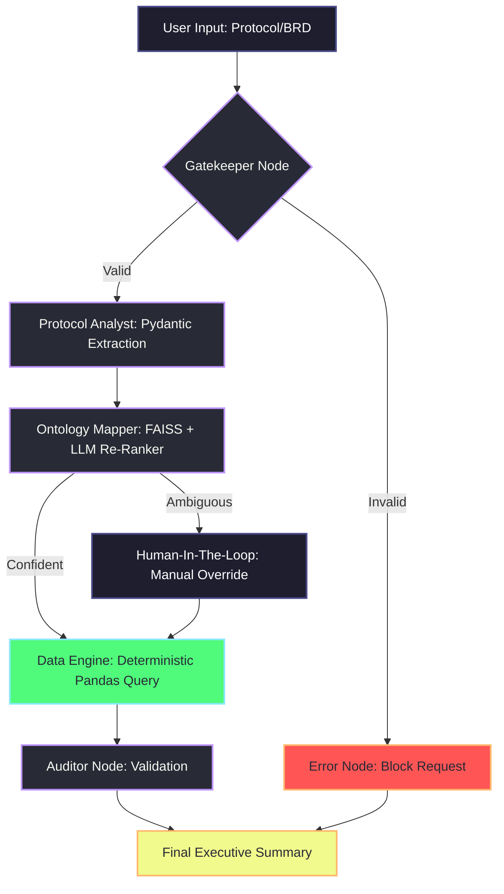

# 🏛️ Clinical Trial Patient Matcher: System Architecture & Journey 

Welcome to the deep dive of the **Clinical Trial Patient Matcher**. This project is a proof-of-concept that leverages a Multi-Agent LangGraph workflow to accurately match patients to clinical trials. Its defining feature is a hybrid approach combining large language models (LLMs) for complex reasoning with deterministic data engines to eliminate AI hallucinations.

## 🖼️ Architecture Overview

The system operates as a pipeline of specialized agents, each designed for a specific task to ensure optimal performance, low cost, and high accuracy.

### 🔀 Workflow Diagram (Mermaid)

## 🤖 Agent Roles & Responsibilities

1. **🛡️ Gatekeeper (LLaMA-3.1-8b)**: The frontline defense. It acts as a semantic router, analyzing the initial user input to ensure it is a valid clinical trial protocol or medical criteria. It instantly rejects generic chat, off-topic questions, or prompt injection attempts, saving compute resources.
2. **📄 Protocol Analyst (LLaMA-3.1-70b)**: The heavy-lifter. This agent reads the dense, unstructured clinical documents (BRDs) and extracts the exact inclusion and exclusion criteria. Crucially, it uses **Pydantic schema enforcement** (`with_structured_output`) to guarantee that the output is formatted exactly as the downstream systems need it (e.g., separating `age_min`, `medication`, and `exclude_medication`).
3. **🔗 Ontology Mapper (FAISS + LLM Re-Ranker)**: The translator. Real-world medical text is messy (e.g., "High BP" in a protocol vs. "Hypertension" in a database). This agent uses a FAISS vector database containing our structured ontology to find the closest matches. If multiple matches are found, a smaller LLM is used to re-rank and select the most logically sound clinical mapping.
4. **🔍 Data Engine (Pandas)**: The source of truth. LLMs are notoriously bad at math and exact database querying (hallucinations). To solve this, the LLMs *never* touch the patient data directly. Instead, the mapped criteria are handed off to a deterministic Pandas engine. This ensures that 100% of the returned patients *actually* meet the criteria—no invented patients, no missed data points.
5. **⚖️ Auditor**: The final check. It reviews the deterministic results from the Data Engine, verifies that the constraints were met, and formats the output into a clean, human-readable executive summary.

---

## 🧗 Challenges Faced & How I Solved Them

Building an AI workflow for healthcare data presents unique hurdles. Here is the journey of overcoming them:

### Challenge 1: LLM Hallucinations in Patient Data
**The Problem**: Initially, if I asked an LLM to "find patients over 50 with Diabetes," it would often hallucinate records, return patients who were 49, or generate SQL queries with syntax errors.
**The Fix**: I completely separated the reasoning from the execution. I designed the architectural pattern where LLMs are *only* used for reading text and structuring parameters (Language Tasks). The actual searching is delegated to a rigid, deterministic Python Pandas script.

### Challenge 2: API Rate Limits and Cloud Quotas
**The Problem**: Using multiple specialized LLMs (Gatekeeper -> Extractor -> Mapper) sequentially caused the application to hit the strict Requests-Per-Minute (RPM) and Tokens-Per-Minute (TPM) limits on the free tiers of API providers like Groq.
**The Fix**: I implemented several resilience mechanisms:
*   **The Gatekeeper**: Failing fast on bad input saves tokens.
*   **`@retry` Decorators**: using the `tenacity` library to implement **exponential backoff**. If an API limit is hit, the system gracefully pauses and retries rather than crashing.
*   **Context Truncation**: A safety net function (`get_safe_document_context`) to optionally truncate massive documents, ensuring they don't blow out the single-request context window.

### Challenge 3: Structured Output Failures (`BadRequestError`)
**The Problem**: For complex BRDs, the 70b parameter model would occasionally fail to return a valid JSON object fitting the Pydantic schema, crashing the entire pipeline with a `BadRequestError`. This happened because the model was missing data and couldn't construct the rigid schema.
**The Fix**:
*   I overhauled the `ClinicalCriteria` Pydantic class to make every field `Optional[]`. This explicitly gave the LLM "permission" to leave missing criteria blank instead of failing the validation.
*   I added a robust `try-except` block in the `run_extractor` node that catches API failures and returns an empty JSON template, allowing the pipeline to degrade gracefully rather than crash entirely.
*   I evaluated different models and switched to the one most reliable for strict schema generation on the platform (`llama-3.1-70b-versatile`).

### Challenge 4: EC2 Deployment - "No space left on device"
**The Problem**: When containerizing the application with Docker to deploy on a free-tier AWS EC2 instance (t2.micro), the build process repeatedly failed because the 8GB default EBS volume ran out of space.
**The Fix**:
*   The culprit was the massive `torch` (PyTorch) library needed for embeddings, which installs CUDA GPU drivers by default. Since the EC2 instance is CPU-only, I optimized the `requirements.txt` to pull the lightweight, CPU-only version of PyTorch (`--extra-index-url https://download.pytorch.org/whl/cpu`).
*   I mapped the heavy data files (the healthcare database and the sample BRD documents) permanently into an **AWS S3 Bucket**. Instead of bundling large CSVs and Word docs into the Docker image, the application fetches them via HTTP on startup. This drastically shrank the image size and completely solved the storage problem.

---

## 🧠 Key Learnings & Takeaways

1. **Multi-Agent Orchestration**: LangGraph fundamentally changed how I approach AI. Instead of one massive prompt trying to do everything poorly, dividing tasks into micro-agents (routing, extracting, mapping) creates a system that is infinitely more debuggable and reliable.
2. **Hybrid Determinism**: The future of Enterprise AI isn't just bigger LLMs; it's using LLMs as "translators" to power traditional, secure, deterministic code. Trusting an LLM to generate a variable but trusting Pandas to execute the logic is a game-changer for data integrity.
3. **Cloud Infrastructure & Optimization**: Deploying a complex AI app to a free-tier server taught me real-world optimization. Learning to hunt down bloated dependencies (like the GPU drivers in PyTorch) and leveraging cheap object storage (S3) for data separation are skills that scale directly to enterprise production environments.
4. **Resilience over Perfomance**: In a multi-step Agentic workflow, an API timeout at step 4 ruins the whole experience. Building robust retry logic (`tenacity`) and fallback states is just as important as the core AI prompts.

This project evolved from a simple scripted prompt into a resilient, cloud-deployed, multi-agent AI architecture capable of real-world clinical application.
